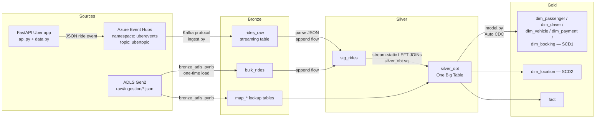
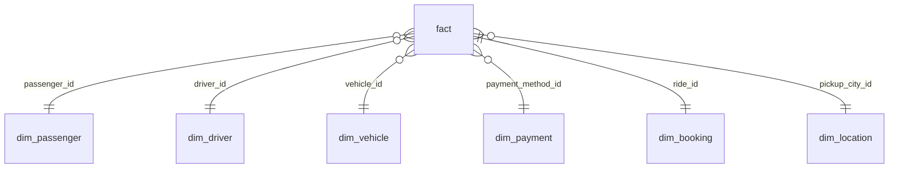

# Code_Files — How the Uber ETL Pipeline Works

This folder holds the code for a **streaming ETL pipeline** on Databricks. It combines **historical (bulk) ride data** with **live ride events** and processes them through the **Medallion Architecture** (Bronze → Silver → Gold).

The pipeline is built with **Spark Declarative Pipelines (SDP)**, formerly Delta Live Tables / Lakeflow Declarative Pipelines, using `from pyspark import pipelines as dp`. SDP takes care of orchestration, checkpoints, schema handling and CDC/SCD, so the code only says *what* each table should contain.

---

## 1. Big Picture



All tables are written to the Unity Catalog location **`uber.bronze.*`**. The layer is a logical label; this project keeps every table in one schema.

---

## 2. Files in This Folder

| File | Layer | Type | Purpose |
|---|---|---|---|
| [bronze_adls.ipynb](bronze_adls.ipynb) | Bronze | Notebook (one-off) | Loads the **lookup/mapping tables** and the **historical `bulk_rides`** from ADLS into Delta tables |
| [ingest.py](ingest.py) | Bronze | SDP pipeline source | Reads **live ride events** from Azure Event Hubs over the Kafka protocol into `rides_raw` |
| [silver.py](silver.py) | Silver | SDP pipeline source | Merges bulk and streaming rides into one staging table, **`stg_rides`** |
| [silver_obt.ipynb](silver_obt.ipynb) | Silver | Notebook (exploration) | Prototypes the JSON parsing and **generates the OBT SQL with a Jinja template**. Also used to test the Gold layer |
| [silver_obt.sql](silver_obt.sql) | Silver | SDP pipeline source | The rendered Jinja SQL. Creates **`silver_obt`**, the One Big Table (rides joined with all lookups) |
| [model.py](model.py) | Gold | SDP pipeline source | Builds the **star schema**: 6 dimensions (SCD1 + SCD2) and 1 fact table, using Auto CDC |

> **Pipeline vs. notebooks:** `ingest.py`, `silver.py`, `silver_obt.sql` and `model.py` sit in the SDP pipeline's *transformation* folder and run as one pipeline. The `.ipynb` notebooks run by hand: `bronze_adls.ipynb` is the setup/initial load and `silver_obt.ipynb` is for exploration and testing.

---

## 3. Upstream: Where the Data Comes From

These files live in the repo root, outside `Code_Files`, and are summarised here for context.

### 3.1 Live events: FastAPI + Event Hubs
- **[data.py](../data.py)** uses `Faker` to generate a realistic fake Uber ride: passenger, driver, vehicle, pickup/dropoff, fare breakdown, rating and so on. It also defines the mapping lists (vehicle types, makes, payment methods, ride statuses, cities, cancellation reasons).
- **[connection.py](../connection.py)** `send_to_event_hub()` serialises the ride to JSON and sends it to Azure Event Hubs with `EventHubProducerClient`. It uses the **Send** shared-access-policy connection string from `.env` (`CONNECTION_STRING`, `EVENT_HUBNAME`).
- **[api.py](../api.py)** is a FastAPI app. Each hit on `/book` generates one ride and pushes it to Event Hubs, which simulates a user booking a ride.

**Event Hubs setup notes:**
- Use the **Standard tier** or higher. Basic tier has no Kafka endpoint, and Spark needs that endpoint to read the hub.
- Kafka ↔ Event Hubs terms: Cluster = Namespace, Topic = Event Hub, Partition = Partition, Consumer Group = Consumer Group.
- Two SAS policies: **Send** for the producer app and **Listen** for Databricks.

### 3.2 Historical and reference data: ADLS
The JSON files listed in [files_array.json](../files_array.json) are landed in the ADLS container at `raw/ingestion/`:
`map_cities`, `map_cancellation_reasons`, `map_payment_methods`, `map_ride_statuses`, `map_vehicle_makes`, `map_vehicle_types`, `bulk_rides`.
(An ADF pipeline does this with a **Lookup** activity that reads the file list and a **ForEach** activity that copies each file.)

---

## 4. Bronze Layer: Raw Data, As-Is

Bronze = data copied from the source in its original form, with no business transformation.

### 4.1 `bronze_adls.ipynb`: Lookup tables and historical rides

**Cell 1, mapping tables:**
```python
for file in files:
    url = f"https://dluberprojectdev.blob.core.windows.net/raw/ingestion/{file['file']}.json?<your-token>"
    df = pd.read_json(url)                         # read JSON from ADLS via SAS URL
    df_spark = spark.createDataFrame(df)           # pandas -> Spark
    df_spark.write.format("delta").mode("overwrite")\
            .option("overwriteSchema", "true")\
            .saveAsTable(f"uber.bronze.{file['file']}")
```
- Creates `uber.bronze.map_cities`, `map_cancellation_reasons`, `map_payment_methods`, `map_ride_statuses`, `map_vehicle_makes`, `map_vehicle_types`.
- `overwrite` + `overwriteSchema` means each re-run fully refreshes these small reference tables.

**Cell 2, historical rides (one-time load):**
```python
if not spark.catalog.tableExists("uber.bronze.bulk_rides"):
    df_spark.write.format("delta").mode("overwrite").saveAsTable("uber.bronze.bulk_rides")
```
- The `tableExists` guard makes this an **idempotent one-time initial load**. Historical data is loaded once and never re-loaded or duplicated.

### 4.2 `ingest.py`: Live rides from Event Hubs → `rides_raw`

```python
EH_CONN_STR = spark.conf.get("connection_string")   # Listen-policy conn string, set as a pipeline config param

KAFKA_OPTIONS = {
  "kafka.bootstrap.servers" : f"{EH_NAMESPACE}.servicebus.windows.net:9093",  # Event Hubs Kafka endpoint
  "subscribe"               : EH_NAME,                                        # topic = event hub name
  "kafka.sasl.mechanism"    : "PLAIN",
  "kafka.security.protocol" : "SASL_SSL",
  "kafka.sasl.jaas.config"  : '... username="$ConnectionString" password="<conn str>";',
  "maxOffsetsPerTrigger"    : 10000,       # max events per micro-batch (rate limiting)
  "failOnDataLoss"          : 'true',      # fail if offsets expire instead of silently skipping
  "startingOffsets"         : 'earliest'   # first run reads everything still retained in the hub
}

@dp.table
def rides_raw():
    df = spark.readStream.format("kafka").options(**KAFKA_OPTIONS).load()
    df = df.withColumn("rides", col("value").cast("string"))
    return df
```

Key points:
- **`@dp.table`** on a function that returns a *streaming* DataFrame creates a **streaming table** called `rides_raw`. SDP manages the checkpoint, so offsets are remembered across restarts and you don't need to set `checkpointLocation` by hand.
- Event Hubs is read with Spark's **Kafka connector**. The username is the literal `$ConnectionString` and the password is the connection string itself.
- Kafka delivers `value` as **binary** (bytes), which displays like hex. `.cast("string")` decodes the bytes as UTF-8, giving the original JSON text in the `rides` column. The JSON is **not parsed** here, so Bronze stays raw.
- Kafka metadata columns (`key`, `topic`, `partition`, `offset`, `timestamp`, …) are kept as well.
- The connection string comes from `spark.conf`, set in the pipeline settings. It is never hard-coded.

**Bronze outputs:** `map_*` (6 tables), `bulk_rides`, `rides_raw`.

---

## 5. Silver Layer: Clean, Unify, Enrich

### 5.1 `silver.py`: Combine historical and streaming into `stg_rides`

This step joins the **historical + live** data together.

```python
dp.create_streaming_table("stg_rides")          # 1. empty target streaming table

@dp.append_flow(target="stg_rides")              # 2. flow #1: historical rides
def rides_bulk():
    df = spark.readStream.table("bulk_rides")
    df = df.withColumn("booking_timestamp", col("booking_timestamp").cast("timestamp"))
    return df

@dp.append_flow(target="stg_rides")              # 3. flow #2: live rides
def rides_stream():
    df = spark.readStream.table("rides_raw")
    return df.withColumn("parsed_rides", from_json(col("rides"), rides_schema))\
             .select("parsed_rides.*")
```

How it works:
- **`create_streaming_table`** declares one target table.
- **Two `@dp.append_flow`s write into the same target.** This is the SDP pattern for unioning several sources into one table *incrementally*. Each flow keeps its own checkpoint, so:
  - `rides_bulk` reads `bulk_rides` once. After the initial load it has nothing new, so it does no further work.
  - `rides_stream` keeps picking up new events as they arrive in `rides_raw`.
  - You can add or remove a flow later without a full refresh of the target.
- **`rides_schema`** is an explicit `StructType` with 43 fields. `from_json` turns the JSON string into a struct, and `select("parsed_rides.*")` flattens it into columns. The schema matches the `bulk_rides` columns so both flows produce the same shape.
- `booking_timestamp` is cast to `timestamp` in the bulk flow, because the pandas → Spark load leaves it as a different type. In the stream flow the schema already declares it as `TimestampType`. The column has to be a real timestamp because the next step uses it as the **watermark** column.

### 5.2 `silver_obt.ipynb`: Prototyping and Jinja-generated SQL

This is the exploration notebook. It is not part of the pipeline.
1. **Tests the JSON parsing** on `rides_raw` with a batch read (`spark.read`) before putting it into `silver.py`.
2. **Generates the OBT SQL with Jinja2** instead of hand-writing a long join:
   - `jinja_config` is a list of dicts, one per table, with keys `table` (name + alias), `select` (columns to pull), `on` (join condition) and `where` (optional filter).
   - The template renders:
     - `SELECT` → every config's `select`, comma separated
     - `FROM` → the first config is the base table, and each later one becomes `LEFT JOIN <table> ON <on>`
     - `WHERE` → added only if a `where` is non-empty, with conditions joined by `AND`
   - The rendered SQL is printed and checked with `spark.sql(...)`, then pasted into `silver_obt.sql` with streaming syntax added.
   - **Why Jinja?** It is metadata-driven. To add a lookup table or column you edit the config, not the SQL, and the code can be reused for other OBTs.
3. Dry-runs the Gold dimension selects and **tests the Gold layer** (see §6.4).

### 5.3 `silver_obt.sql`: The One Big Table (`silver_obt`)

```sql
CREATE OR REFRESH STREAMING TABLE silver_obt AS
SELECT stg_rides.<all 43 ride columns>,
       map_vehicle_makes.vehicle_make,
       map_vehicle_types.vehicle_type, description, base_rate, per_mile, per_minute,
       map_ride_statuses.ride_status,
       map_payment_methods.payment_method, is_card, requires_auth,
       map_cities.city AS pickup_city, state, region, updated_at AS city_updated_at,
       map_cancellation_reasons.cancellation_reason
FROM STREAM(uber.bronze.stg_rides)
     WATERMARK booking_timestamp DELAY OF INTERVAL 3 MINUTES stg_rides
LEFT JOIN uber.bronze.map_vehicle_makes        ON stg_rides.vehicle_make_id        = map_vehicle_makes.vehicle_make_id
LEFT JOIN uber.bronze.map_vehicle_types        ON stg_rides.vehicle_type_id        = map_vehicle_types.vehicle_type_id
LEFT JOIN uber.bronze.map_ride_statuses        ON stg_rides.ride_status_id         = map_ride_statuses.ride_status_id
LEFT JOIN uber.bronze.map_payment_methods      ON stg_rides.payment_method_id      = map_payment_methods.payment_method_id
LEFT JOIN uber.bronze.map_cities               ON stg_rides.pickup_city_id         = map_cities.city_id
LEFT JOIN uber.bronze.map_cancellation_reasons ON stg_rides.cancellation_reason_id = map_cancellation_reasons.cancellation_reason_id
```

### silver doubts and explanation
1. silver_obt.ipynb: a scratchpad
Yes, it's an exploration notebook, but it does a bit more than test code:

It tests the from_json parsing of rides_raw against rides_schema.
It has DROP TABLE stg_rides and select * cells for resetting and inspecting.
It builds the Jinja template that generates the OBT SQL. The jinja_config list holds each table, its columns and its join condition, and the rendered output is what you pasted into silver_obt.sql.
It has the scratch queries for the gold layer: dedup for the fact table, dedup for dim_location, and an SCD2 join test using __END_AT IS NULL.
The notebook doesn't run in the pipeline. It's where you develop things before they go in.

2. silver.py: the pipeline notebook
They are bulk rides and raw rides.
bulk_rides is the historical or initial load. It's a table that already has columns, and only booking_timestamp gets cast to a timestamp.
rides_raw is the live stream, e.g. from Event Hubs. Each row has one JSON string column called rides, which from_json parses with rides_schema into proper columns.
Both are appended into one streaming table, stg_rides, through two @dp.append_flow functions. The stg_rides table has the same columns whichever source a row came from.

3. silver_obt.sql: the OBT
Yes. It takes stg_rides (the fact data) and LEFT JOINs the six map_* lookup tables: vehicle makes, vehicle types, ride statuses, payment methods, cities and cancellation reasons. The result is one wide table, silver_obt. The gold layer then splits it again into a fact table and dimensions such as dim_location. LEFT JOINs mean a ride is kept even if a lookup match is missing.

4. What the watermark does
WATERMARK booking_timestamp DELAY OF INTERVAL 3 MINUTES tells Spark how long to wait for late rows. The rule is:

watermark = (latest booking_timestamp seen so far) − 3 minutes

Spark treats anything older than the watermark as too late. It can then free the state it was keeping for those old rows, so memory stays bounded. Without a watermark, a stream-to-stream join or an aggregation has to keep state forever.

UPI example
Say you want the total amount per 3-minute window, with a 3-minute watermark.

#	Amount	Event time (when payment happened)	Arrives at pipeline
1	₹100	10:00	10:00
2	₹200	10:02	10:02
3	₹300	10:08	10:08
4	₹400	10:01	10:09 (the bank's server was slow)
Windows: A = 10:00–10:03, B = 10:03–10:06, C = 10:06–10:09.

Step by step:

₹100 arrives. The highest event time is 10:00, so the watermark is 9:57. It goes into window A.
₹200 arrives. The highest event time is 10:02, so the watermark is 9:59. It goes into window A. Window A now totals ₹300.
₹300 arrives. The highest event time is 10:08, so the watermark jumps to 10:05. Window A ended at 10:03, which is before 10:05. Spark considers window A complete, emits ₹300, and deletes its state from memory.
₹400 arrives with event time 10:01. It belongs in window A. But 10:01 < 10:05 (the watermark), and window A is already closed, so it's a late record. Spark drops it.
The true total for window A is ₹700, but your table shows ₹300. The missing ₹400 is the cost of the watermark.

Compare: if ₹400 had an event time of 10:06 and arrived at 10:09, then 10:06 ≥ 10:05. It's inside the allowed delay, goes into window C, and nothing is lost.

So "delay of 3 minutes" means: Spark waits until the stream's clock is 3 minutes past a window's end before closing it. A record that is more than about 3 minutes behind the newest event time misses that window.

When late-arriving records happen
Mobile or network problems. The phone is offline, in a tunnel, or on weak signal, and the app sends events later. This matches the Uber rides.
Retries. A failed send is retried minutes later.
Slow upstream systems. Bank or payment gateway delays, queue backlogs, or slow partitions in Event Hubs or Kafka.
Outages and replays. A producer or pipeline goes down and later sends everything it buffered.
Batch uploads. Data is collected on devices or in files and uploaded in groups.
Clock skew. Device clocks that are wrong produce misleading event times.
Backfills. Historical data is loaded into the same stream.
Choosing the delay
A short delay gives fast results and low memory, but more records get dropped.
A long delay catches more late data, but results arrive later and more state is held.
For the exact guarantee, Spark promises to process data that is less than the delay behind. Data later than that may be dropped, but isn't guaranteed to be.

In your OBT query, the joins are stream-to-static, so there is no window or state that closes, and the watermark has little effect there. It would matter if you added something like "rides per city per 3 minutes" in the gold layer

Important caveat for your pipeline. The watermark only matters when Spark keeps state. In your query, the joins are stream-to-static table joins (stg_rides against the map_* tables). Those joins keep no state, so the watermark probably does little here. It would matter for aggregations such as "rides per 5 minutes" or for stream-to-stream joins. I haven't run this on Databricks, so I can't confirm exactly how Lakeflow treats it. It's still harmless to keep as a safety setting.

Two other things I noticed:

The map tables are static snapshots. A ride that streams in before its lookup row exists gets NULLs for that column, and the stream won't go back and fix it later.
booking_timestamp is the event time, not the arrival time. Bulk data will have old booking timestamps. If it's ever combined with the stream under one watermark, old rows could be treated as late.


Concepts:
- **One Big Table (OBT):** a single wide, denormalised table with every ride attribute and every looked-up description. It is easy to query and serves as the single source for building the Gold star schema.
- **`STREAM(...)`** reads `stg_rides` incrementally, so only new rows are processed on each update.
- **Stream–static join:** `stg_rides` is a stream and the `map_*` tables are static Delta tables. Every micro-batch is joined against the *current* snapshot of the lookup tables.
- **`LEFT JOIN`** keeps a ride even when it has no matching lookup, for example `cancellation_reason_id` is null on completed rides.
- **`WATERMARK booking_timestamp DELAY OF INTERVAL 3 MINUTES`** tells Spark how late an event may arrive, measured on `booking_timestamp`. Spark uses this to bound the state it keeps for stateful operations, and it lets the downstream streaming dedup/CDC clean up old state.
- `map_cities.updated_at` is exposed as **`city_updated_at`**. Gold uses it as the sequencing column for SCD Type 2 on locations.

**Silver outputs:** `stg_rides`, `silver_obt`.

---

## 6. Gold Layer: Star Schema (`model.py`)

Gold splits the OBT into a **dimensional model**: one fact table surrounded by dimension tables. Every table follows the same three-step pattern:

```python
@dp.view                                   # 1. source view: pick columns + dedupe
def dim_x_view():
    df = spark.readStream.table("uber.bronze.silver_obt")
    df = df.select(<dimension columns>)
    df = df.dropDuplicates(subset=[<business key>])
    return df

dp.create_streaming_table("dim_x")         # 2. target table

dp.create_auto_cdc_flow(                   # 3. CDC/merge from view into target
    target="dim_x", source="dim_x_view",
    keys=[<business key>],                 #    how to match rows (upsert key)
    sequence_by=<ordering column>,         #    which version is "latest"
    stored_as_scd_type=1 or 2,
)
```

- **`@dp.view`** is a temporary, pipeline-scoped view. It is not saved to the catalog and only feeds the CDC flow.
- **`dropDuplicates`** on a stream removes repeats of the same key inside the stream.
- **`create_auto_cdc_flow`** (formerly `APPLY CHANGES INTO`) does the MERGE for you. It inserts new keys, updates existing ones, and handles out-of-order data using `sequence_by`.
  - **SCD Type 1** overwrites: only the latest version of each key is kept, with no history.
  - **SCD Type 2** keeps history: each change adds a new row, and SDP adds `__START_AT` / `__END_AT` columns. The current row has `__END_AT IS NULL`.

### 6.1 Dimensions

| Table | Key | SCD | Columns |
|---|---|---|---|
| `dim_passenger` | `passenger_id` | 1 | passenger_name, passenger_email, passenger_phone |
| `dim_driver` | `driver_id` | 1 | driver_name, driver_rating, driver_phone, driver_license |
| `dim_vehicle` | `vehicle_id` | 1 | vehicle_make_id, vehicle_type_id, vehicle_model, vehicle_color, license_plate, vehicle_make, vehicle_type |
| `dim_payment` | `payment_method_id` | 1 | payment_method, is_card, requires_auth |
| `dim_booking` | `ride_id` | 1 | confirmation_number, ride_status_id, cancellation_reason_id, pickup/dropoff location ids, addresses, lat/long, booking_timestamp, dropoff_timestamp |
| `dim_location` | `pickup_city_id` | **2** | pickup_city, region, state, city_updated_at |

**Why `dim_location` is SCD Type 2:** city attributes such as region or state can change over time, and we want each ride to be reported against the city's values *as they were then*. Here `sequence_by = "city_updated_at"` is a real change timestamp, and the dedup is on `(pickup_city_id, city_updated_at)`, so every distinct version of a city reaches the CDC flow and becomes a history row.

For the SCD1 dimensions, `sequence_by` is set to the key itself. Every version of a key then has the same sequence value. This works because the data is effectively insert-only per key, but there is no real "latest wins" ordering (see §8).

### 6.2 Fact table

| Table | Keys (composite) | SCD | Measures |
|---|---|---|---|
| `fact` | ride_id, pickup_city_id, payment_method_id, driver_id, passenger_id, vehicle_id | 1 | distance_miles, duration_minutes, base_fare, distance_fare, time_fare, surge_multiplier, total_fare, tip_amount, rating, base_rate, per_mile, per_minute |

The fact table has **foreign keys** to each dimension plus the **numeric measures** of a ride. The grain is **one row per ride**.

### 6.3 Data model



### 6.4 Querying Gold (SCD2 join)

From `silver_obt.ipynb`: to get the **current** location attributes for a fact row, join on the key and filter to the open SCD2 row.

```sql
SELECT fact.ride_id, fact.base_fare, dim.region
FROM uber.bronze.fact AS fact
LEFT JOIN uber.bronze.dim_location AS dim
  ON fact.pickup_city_id = dim.pickup_city_id
 AND dim.`__END_AT` IS NULL          -- current version only
```
(For a point-in-time join, use `booking_timestamp BETWEEN __START_AT AND COALESCE(__END_AT, '9999-12-31')` instead.)

---

## 7. End-to-End Run Order

1. **Infra:** ADLS container `raw/ingestion/` with the JSON files (via ADF); an Event Hubs namespace `uberevents` (Standard tier) with hub `ubertopic`, a Send policy and a Listen policy.
2. **Run `bronze_adls.ipynb`** to create the `map_*` tables and the one-time `bulk_rides`.
3. **Create the SDP (ETL) pipeline** in Databricks:
   - Source files: `ingest.py`, `silver.py`, `silver_obt.sql`, `model.py`
   - Default catalog/schema: `uber` / `bronze`
   - Configuration: `connection_string = <Listen-policy connection string>`
4. **Start the FastAPI app** (`python api.py`) and book rides via `/book`. Events flow into Event Hubs.
5. **Run or update the pipeline.** SDP works out the dependency graph (DAG) from the table reads and runs:
   `rides_raw` → `stg_rides` (+ `bulk_rides`) → `silver_obt` → dims & fact.
   In triggered mode each run processes only new data. In continuous mode it runs as data arrives.

### Table lineage summary

```
ADLS map_*.json  ──► map_vehicle_makes, map_vehicle_types, map_ride_statuses,
                     map_payment_methods, map_cities, map_cancellation_reasons ─┐
ADLS bulk_rides.json ──► bulk_rides ──(append_flow rides_bulk)──┐               │
Event Hubs ──► rides_raw ──(append_flow rides_stream)──────────►├─► stg_rides ──┴─► silver_obt
                                                                                     │
                     dim_passenger, dim_driver, dim_vehicle, dim_payment,  ◄─────────┤
                     dim_booking (SCD1), dim_location (SCD2), fact  ◄────────────────┘
```

---

## 8. Key Concepts Cheat-Sheet

| Concept | Where | One-liner |
|---|---|---|
| Medallion architecture | whole project | Bronze = raw, Silver = cleaned/joined, Gold = business-ready model |
| Kafka-compatible Event Hubs | `ingest.py` | Read Event Hubs with Spark's Kafka source on port 9093 using SASL_SSL |
| Binary → string cast | `ingest.py` | The Kafka `value` is bytes, and `.cast("string")` gives back the JSON text |
| `@dp.table` | `ingest.py` | Declares a managed (streaming) table; SDP handles checkpoints |
| `create_streaming_table` + multiple `@dp.append_flow` | `silver.py` | Incremental union of bulk + live sources into one table |
| `from_json` + explicit schema | `silver.py` | Parse a JSON string into typed columns |
| Jinja-templated SQL | `silver_obt.ipynb` | Config-driven generation of multi-join SQL |
| One Big Table | `silver_obt.sql` | Denormalised wide table, the single source for Gold |
| Stream–static join | `silver_obt.sql` | A streaming fact joined to static lookup tables on each micro-batch |
| Watermark | `silver_obt.sql` | Limit on event lateness, which bounds streaming state |
| `@dp.view` | `model.py` | Temporary pipeline view, not stored in the catalog |
| `create_auto_cdc_flow` | `model.py` | Declarative MERGE/upsert with SCD1 or SCD2 |
| SCD Type 1 vs 2 | `model.py` | Overwrite vs. keep history (`__START_AT` / `__END_AT`) |
| Checkpointing | SDP-managed | Saves offsets/state so a restarted stream resumes with no loss or duplicates |

---

## 9. Known Quirks / Things to Improve

These are worth knowing before changing the code later:

- **Mixed table references in `model.py`:** `dim_passenger_view` reads `"silver_obt"` (unqualified) and the rest read `"uber.bronze.silver_obt"`. Both resolve to the same table when the pipeline's default schema is `uber.bronze`, but pick one style.
- **`dim_location_view` uses `@dp.table`, not `@dp.view`.** It is therefore stored as a real streaming table in the catalog. Switch to `@dp.view` if you don't need it saved.
- **`fact_view` reads `silver_obt` twice** (duplicate line). This is harmless but redundant.
- **SCD1 `sequence_by` = the key column.** All versions of a key get the same sequence, so "latest" is not well defined. A real timestamp (for example `booking_timestamp`) would be better.
- **Fact key is composite.** `ride_id` is unique on its own, so `keys=["ride_id"]` would be enough.
- **`dropDuplicates` on a stream without a watermark** (in the Gold views) keeps dedup state forever. A watermark-based dedup (`dropDuplicatesWithinWatermark`) would bound it.
- **Event Hubs retention vs. `failOnDataLoss=true`:** if the pipeline is stopped longer than the hub's retention, offsets expire and the stream fails. You then need a full refresh or a reset of the checkpoint.
- **Secrets:** the SAS token in `bronze_adls.ipynb` and the connection string should come from **Databricks secret scopes** (`dbutils.secrets.get`), not plain text or pipeline config.
- `silver_obt.ipynb` cell 12 selects columns without `ride_id` and then dedupes on `ride_id`, which would error. It is a leftover exploration cell.
