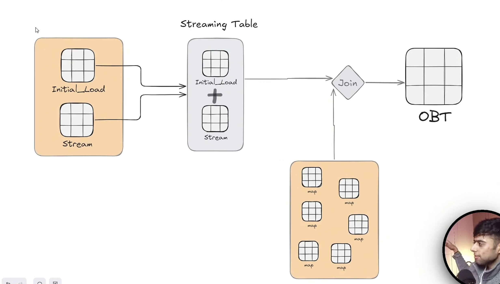

 There is a light difference between Kafka and azure eventhubs, both are message Q services, but where eventhubs are separately built for azure and Kafka is cloud agnostic and created by Apache. As usual, even hubs are extra translational layer, Microsoft build them for converting customers into event hub customers without any large changes and transition smoothly to the event up by changing the source, as usual as usual event hubs can directly translate Kafka service to event help service using event hubs both bills separately, but they serve the same purpose.

 Kafka have producer consumer and in between them, we have topics and topics have partition and every partition have separate consumer at a given time.

 Each partition is assigned to one consumer given time.
 kafka - event hubs

 Cluster - event hub namespace
 Topic - event hub
 Partition -  partition
 Consumer groups - consumer groups
 
 While creating event hub resource in Azure always use standard tier as standard tier supports the translation. If you use basic tier, it won't support that.

 In Kafka, we need to manage all cluster size compute or vm size throughput, et cetera, but in eventhubs will be taken care of all the infrastructure.

 In as your event hub, it is measured in throughputs TU or process unit PU where the amount of incoming data and outgoing data. Incoming data is called as ingress that is one number per second or thousand events per second exiting data is known as egress, it is 2 MB per second or 4096 events per second. TUs can be increased manually or can be auto inflated if we take the box of auto inflated while creating the event hub resource in Azure.

 Data in ADF generally resides in data assets, that's why we create datasets and use linked services to link two services.

 always use look up activity while importing data from any API instead of parameters values in ADF look up activity because complex hierarchies of Json may cause problem if we use parameters

 Use the output of before state in next step is known as State full orchestration, 
 Eg so where it will take the output of previous step like all the Json files present in api or repo and use that in forEach activity.

 Lake flow Park declarative pipelines were called as delta live tables, but databricks updated them to spark declarative tables, and call them as SDP, the 
 pros of SDP 
 automatic orchestration 
 declarative processing - ease of CDC change data capture SCD1 SCD2 
 incremental processing - introduction of materialised views.

 Exploration folder is for you where you can just create your notebook just for testing. This will not be a part of your development. 
 
 Transformation is the folder which is responsible for your pipeline for whatever you create under this folder will become the part of your pipeline. there is one small small observation. You will see pipeline as well here in the transformation folder. That means this is the folder which is responsible for developing the pipeline, simple and utilities. 
 
 Everyone knows whenever you build complex. Whenever you work with complex, you need to build your complex logic, so in order to build those complex logic, then you can simply use this utilities folder and you can import it directly within your code from utilities.

 No coming to databricks. Now we have to connect our Aju events and data bricks to do the cleaning process using detail pipeline.

 In cloud, we have created two policies. One is recent policy and other is vision policy event hubs. So now the data need the data to process it. So we use the listen policy, data and event using connection string that is present in legend policy that we have created.

 We get the Kafka connection code from official documents that are present to connect the data bricks and Kafka.

 We use create ETL pipeline in data bricks to start this task and proceed with gold Brown Silver stages.

 Volume is a kind of folder that you register under a scheme, have you ever created a table under a schema good? Have you ever created a view under a schema volume is a new feature that data introduced that means you can now even create a folder as well so that you can just govern files.

 a checkpoint is a mechanism that provides fault tolerance by periodically saving the current state and progress of a real-time streaming pipeline to secure cloud storage.If your streaming job crashes, gets restarted, or is updated due to a code change, Spark uses the checkpoint directory to resume exactly where it left off without losing data (data loss) or processing the same data twice (duplicates)
 How Checkpointing Works Under the HoodWhen you stream data (for example, from your Azure Event Hub to a Delta table), Spark tracks two critical pieces of information inside the checkpoint folder:Offsets (The Log): It records exactly which messages or files have been read. For an Event Hub/Kafka stream, it stores the exact offset numbers.State Management (The Memory): If your streaming pipeline does aggregations (like counting active events per minute using a window), Spark saves the intermediate running counts so it doesn't have to recalculate everything from the beginning of time upon a reboot.
 # Write the stream and enforce checkpointing
(streaming_df.writeStream
    .format("delta")
    .outputMode("append")
    .option("checkpointLocation", "abfss://container@storage.dfs.core.windows.net/checkpoints/eventhub_to_delta")
    .toTable("main.default.eventhub_silver_table")
)

'''
@dp.table
def rides_raw():
    df = spark.readStream.format("kafka")\
                    .options(**KAFKA_OPTIONS)\
                    .load()

    df = df.withColumn("rides",col("value").cast("string"))
    return df
'''
Here when we read column value from Kafka, we get a hex en coded value that we are typecasting into UTFA text using cast and creating a new column called rides and we are storing the whole Json data into that rides column.

When Spark reads from Kafka via format("kafka"), the value column arrives as BINARY (raw bytes). The "hash-like" appearance you see is just Spark's default display of binary data (hex-encoded). When you cast to string with .cast("string"), Spark decodes those raw bytes as UTF-8 text — and the producer on the other end is sending JSON-formatted strings, so that's what you get back.
The data isn't being "converted to JSON" — it was already JSON in the Kafka topic, just stored as bytes. The cast simply decodes the byte array to readable text.

Bronze layer means we are just dumping the data from source it same format without doing any transformation on the data, basically data similar to the source but present in the Azure bronze container.

 I want to perform what that means to apply transformation and I want to write this data into the destination. Don't need to worry about how, I don't need to worry about all of the overhead that I need to manage with streaming, I need to check my location schema location, SDP do everything for me.

by using decortor
@dp.table above the rides_raw function

Function streaming is a special decorator called TP that means our data bricks pipeline pipeline and that's it. That's it. That's exactly you know what if I will create a table streaming table automatically in my catalogue and you will literally see that and show you so before running, that thing, you should always.

For facts we use Pyspark data frames and for static data loading, we use pandas and pandas can also help to connect with the data breaks shared access token easily using API

Now got the data from the API, which is a current Uber website, and there is a historical rides present in Github in bulk rides.json and we have multiple other tables related to cities et cetera to load data sources into bronze layer.

We get live data from the website through azure Eventhub and from the bulk ride data from github which is already present, which is previous data of rides

Now, in order to proceed with creation of tables in the silver layer, we need to combine bulk rides table data with live streaming table rides data, the other dimension tables which are already present to form OBT.

OBT One Big Table built in silver layer

A Python decorator is a function that takes another function as an argument, extends or modifies its behavior, and returns a new function without changing the original function's source code.
Decorators are essentially "wrappers". They are widely used for clean, reusable code in tasks like logging, 
authentication, caching, and timing execution.

 So now we are into silver layer where we create a streaming table and use decorators. Here we use append_flow decorator that is inbuilt present in SDP(spark declarative pipelines).

The existing historical data like bulk rides, vehicle details, et cetera, are already present in Json format and using pandas directly converted them to data frame and stored it in bulk rides table and all other remaining tables

We have rides_raw table with streaming data values are in string json(key, values) format in rides column, now we need to convert them into

Now the streaming data which is coming from the Uber website continuously is received in eventhub using Send policy and using listen policy, we get the data and store it in rides_raw table, but the catch is here that when we listen it from event hubs, we get the data in binary format and we change that to string format, but we need our schema to be same as the existing historical data. So we copy the schema of historical data and stored in variable and use that schema for the streaming data create a data frame
And we combine the historical data and streaming data into one table with same schema and store it in stg_rides table. This whole part is done in silver notebook and the injection part is done in Bronze stage.
 
jinja2 basically helps in writing dynamic SQL queries in data engineering.

DBT data build tool uses jinja2 and it is built on top of it. DBT also have macros. They are kind of functions which are helpful to reuse the SQL queries multiple times whenever we need.

So before moving to gold stage, we should also prepare our pipeline to support SCD2 type because we need to store the historical data of any important column like place, address, et cetera. For example, if you want to know the older residence or city of a particular customer, and also we need the new city and new residence. Then we need to track and store historical data and current data in the same table. This is SCD2.

Consider an example, previous city is New York and current city is Los Angeles
SCD1 here in the column, we directly change near to Los Angeles
Customer_ID	Customer_Name	Current_City
C-5542	    John Doe	        Los Angeles

In SCD2, here we create a new row where start date and date and is current city, so here we have two records?
So for New York, the start date and date will be there and his current city column will be false, and for Los Angeles record, there will be started and date will be and each current is true.
Customer_Key (Surrogate)	Customer_ID (Natural)	Customer_Name	City	Start_Date	End_Date	Is_Current
1001	C-5542	John Doe	New York	2024-01-01	2026-03-14	False
1058	C-5542	John Doe	Los Angeles	2026-03-15	NULL (or 9999-12-31)	True

SCD3, we have previous currency effective date, only three, no extra record. No increase in rows.
Customer_ID	Customer_Name	Current_City	Previous_City	Effective_Date
C-5542	John Doe	Los Angeles	New York	2026-03-15

SCD4 here we will have current details in one table and historical data in shadow table where we need two tables, one is for current details and another river for tracking the historical data.
• Main Table (Current Only):
Customer_ID	Customer_Name	City
C-5542	John Doe	Los Angeles

• History Table:
Customer_ID	City	Start_Date	End_Date
C-5542	New York	2024-01-01	2026-03-14
C-5542	Los Angeles	2026-03-15	NULL

SCD6
Combines the attributes of Type 1, Type 2, and Type 3 (1 + 2 + 3 = 6) to offer total historical flexibility.
Customer_Key	Customer_ID	Historical_City (Type 2)	Current_City (Type1)	Start_Date	End_Date	Is_Current

1001	C-5542	New York	Los Angeles	
2024-01-01	2026-03-14	False
1058	C-5542	Los Angeles	Los Angeles	
2026-03-15	NULL	True

Water marking is used to handle late arriving data in streaming tables.
